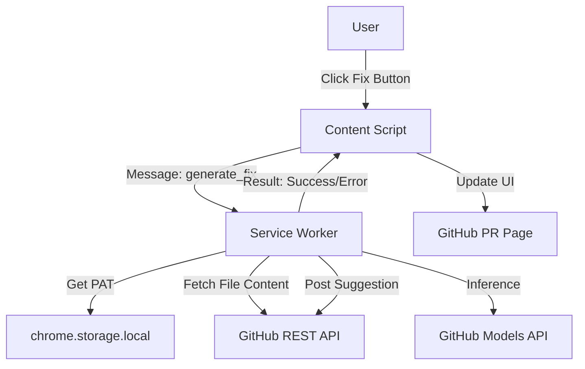

# Design: core

## アーキテクチャ概要

Chrome拡張機能 (Manifest V3) として実装する。
セキュリティ境界を重視し、機密情報 (GitHub PAT) の管理と外部API通信は全て **Service Worker** 内で行う。
UI層 (Content Script / Popup) はユーザー操作の検知と結果表示のみを担当する。

## コンポーネント設計

### Mermaid Diagram



## コンポーネント

1. **Service Worker (`background.ts`)**
   - 責務: API通信の集約、認証トークン管理、ビジネスロジック実行
   - 機能:
     - `chrome.runtime.onMessage` ハンドラ
     - GitHub API クライアント (Octokit 軽量ラッパー想定)
     - GitHub Models API クライアント

2. **Content Script (`content.ts`)**
   - 責務: DOM監視、UI注入、ユーザーアクション検知
   - 機能:
     - `MutationObserver` によるレビューコメント検知
     - "AI Fix" ボタンの注入
     - 実行結果のトースト表示/DOM更新

3. **Popup (`popup.tsx`)**
   - 責務: 設定管理
   - 機能:
     - GitHub PAT の入力・保存・検証
     - 動作ステータスの表示

4. **Options (`options.tsx`)**
   - 責務: 詳細設定 (モデル選択、プロンプトテンプレート編集)
   - 機能:
     - デフォルトモデル (gpt-4o-mini / gpt-4o) の切り替え

## API Endpoints

1. **GitHub REST API**
   - `GET /repos/{owner}/{repo}/contents/{path}`: ファイル内容取得
   - `POST /repos/{owner}/{repo}/pulls/{pull_number}/comments/{comment_id}/replies`: 修正提案投稿 (Suggested Changes)

2. **GitHub Models API**
   - `POST https://models.github.ai/inference/chat/completions`: コード修正生成

## データ構造

### Message Passing (Content -> Background)

```typescript
interface FixRequest {
  action: 'generate_fix';
  payload: {
    owner: string;
    repo: string;
    pullNumber: number;
    commentId: number;
    filePath: string;
    lineNumber: number;
    diffHunk: string;
  };
}
```

### Storage Schema

```typescript
interface LocalStorage {
  githubPat: string;
  selectedModel: 'gpt-4o-mini' | 'gpt-4o';
}
```

## 依存関係

- `react`: UI構築
- `webextension-polyfill`: ブラウザ互換性 (Optional)
- `@octokit/rest` or `fetch`: GitHub API通信 (軽量化のため `fetch` ラッパーを推奨)
